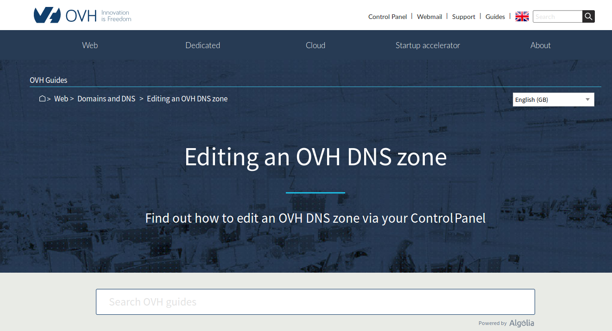
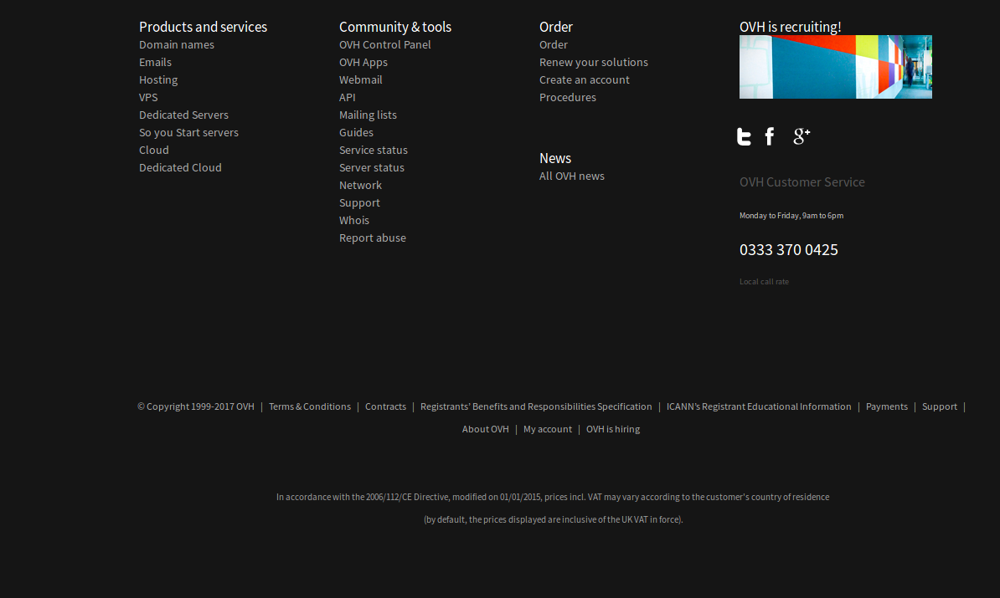
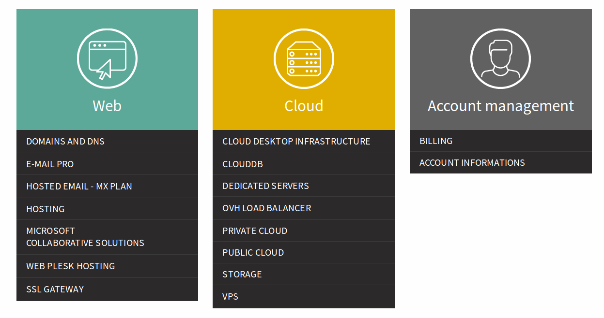
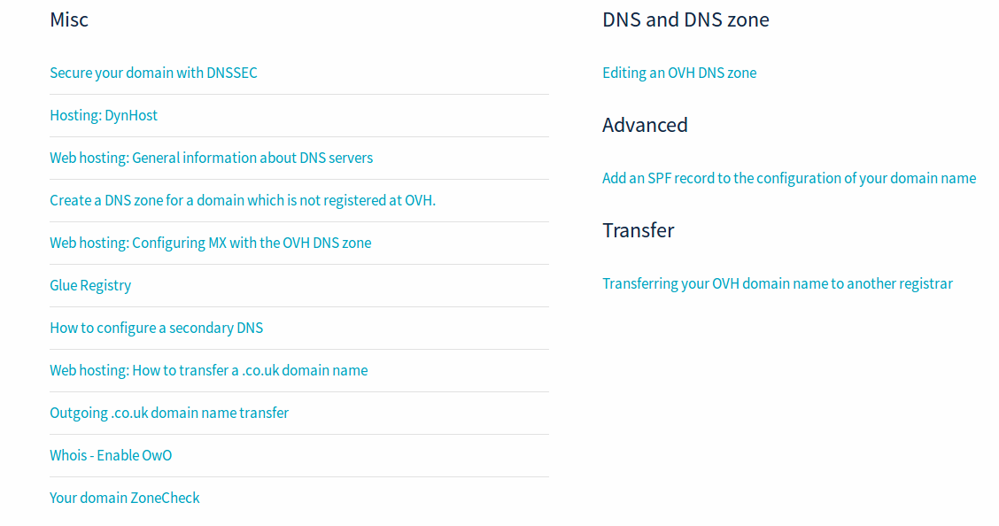
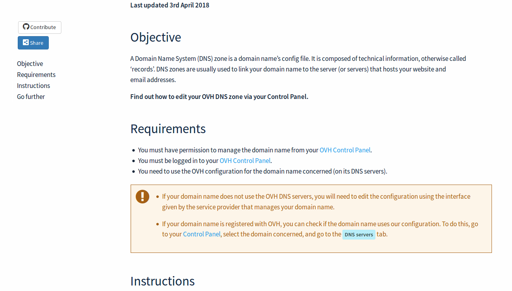

# OVH - Docs rendering engine

[docs.ovh.com](https://docs.ovh.com/) is entirely generated with [Pelican](https://github.com/getpelican/pelican) from `markdown` [files](https://github.com/ovh/docs)

In this repository, you will find all configurations, themes and plugins that we use

## Plugins

### OVH Entities (`plugins/ovh_entities`)
extends [`pelican-entities`](https://github.com/AlexJF/pelican-entities) in order to suit our needs.

#### Entity matching
Because of our docs repository is structured in a hierarchical manner, we needed to easily define search path for entity using regexp 
instead of just a folder name.

```
# repository stucture example
.
├── pages
|   ├── web
|   |   ├── domains
|   |   |   ├── glue-registry
|   |   |   |   ├── guide.en-gb.md (title: Glue Registry)
|   |   |   |   └── guide.fr-fr.md (title: Activer le Glue Registry sur son domaine)
|   |   |   ├── product.en-gb.md (title: Domains and DNS)
|   |   |   └── product.fr-fr.md (title: Domaines et DNS)
|   |   ├── hosting
|   |   |   ├── 24-days
|   |   |   |   ├── day01
|   |   |   |   |   └── guide.fr-fr.md (title: Les bases des sites web)
|   |   |   |   ├── day02
|   |   |   |   |   └── guide.fr-fr.md (title: Choisir et configurer un nom de domaine)
|   |   |   |   └── guide.fr-fr.md (title: Développer votre projet pas à pas avec l'hébergement web OVH)
|   |   |   ├── product.en-gb.md (title: Domains and DNS)
|   |   |   └── product.fr-fr.md (title: Domaines et DNS)
|   |   ├── universe.en-gb.md (title: Web)
|   |   └── universe.fr-fr.md (title: Web)
|   ├── home.en-gb.md (title: OVH - Documentation)
|   └── home.fr-fr.md (title: OVH - Guides)
└── README.md
```

```py
# entities search path regexp configuration in pelicanconf.py
ENTITY_TYPES = {
    "Home": {
        "PATHS": ["home.*.md"],
    },
    "Universe": {
        "PATHS": ["**/universe.*.md"],
    },
    "Product": {
        "PATHS": ["**/product.*.md"],
    },
    "Guide": {
        "PATHS": ["**/guide.*.md"],
    },
}
```

more info about entity naming can be found [here](https://github.com/ovh/docs/blob/master/docs-guideline/docs-guideline.md)

#### Entity children
When needed, for each entity, we add a children property that lists all authorized children (useful in jinja2 templates for children list rendering). 

```py
# entities children configuration in pelicanconf.py
ENTITY_TYPES = {
    "Home": {
        "CHILDREN": ["Universe"], 
    },
    "Universe": {
        "CHILDREN": ["Universe", "Product"], 
    },
    "Product": {
        "CHILDREN": ["Guide"],
    },
    "Guide": {
        "CHILDREN": ["Guide"],
    },
}
```

#### url building
We needed to exclude some part of the default generated url by pelican without the need to include 
the `override_url` and `override_save_as` properties in each file.

Those properties are generated for each entity using the config property `EXCLUDE_SLUGS`

```py
# entities slug exclusion configuration in pelicanconf.py
ENTITY_TYPES = {
    "Universe": {
        "EXCLUDE_SLUGS": ["Home"], # generate universe url without home part
    },
    "Product": {
        "EXCLUDE_SLUGS": ["Home", "Universe"], # generate product url without home and universe part
    },
    "Guide": {
        "EXCLUDE_SLUGS": ["Home", "Universe"], # generate product url without home and universe part
    },
}
```

### OVH markdown (`plugins/ovh_markdown`)
This plugin contains all custom processors for rendering content like `notices` that `markdown parser` does not handle by default.

- `BlockCalloutProcessor` for notices
- `BlockApiProcessor` for ovh api calls
- `BlockCarouselProcessor` for carousels
- `BlockFaqProcessor` for FAQ sections

see markdown usages [here](https://github.com/ovh/docs/blob/master/docs-guideline/markdown-custom.md)

### OVH Filters (`plugins/ovh_filters`)

Contains Jinja2 filters used in templates.

#### breadcrumbs
get an array of (title, url) from parents of an OVH Entity

```jinja
<!-- example -->
<ul>
    
    <li>
        <a href="/{{url}}"{{' class="home"' if loop.index == 1}} >
            <span{{' class="show-for-sr"' if loop.index == 1}}>{{text}}</span></a>
    </li>
    
</ul>
```

#### related
get an array of related guides for a given guide

```jinja
<!-- example -->

...

<div class="column">
    <a href="/{{ related_entity.url }}">
        <span class='parent'>{{ related_entity.parent.title }}</span><br />
        <span class='title'>{{ related_entity.title }}</span>
    </a>
</div>

```

#### visible 
filter visible entities (visible property of entity == True)

```jinja
<!-- example -->

    
    
        <div class="columns">
            <h3>{{section|translate(entity.global)}}</h3>
            <ul class="doc-list">
            
                <li><a href="/{{guide.url}}">{{guide.title}}</a></li>
            
            </ul>
        </div>
    

```

#### translate
translate a content according to a given language. Dictionary defined in [config/translations.yml](./config/translation.yml)

```jinja
<!-- example -->
<h3>{{section|translate(entity.global)}}</h3>
```

## Themes - OVH

stored in the folder `themes/ovh`
```
# structure
.
├── static (will be copied as folder `theme` at root level during build)
|   └── ... (images, css, js, ...)
└── templates
    └── ... (jinja2 templates)
```
### Templates

#### base.html
base template containing all common css, js and jinja blocks

#### entity.html
entity base template (extends base.html) containing all elements shared between all ovh entities
- title
- meta
- hreflang
- menu
- footer
- breadcrumb
- excerpt
- search bar
- analytics





#### home.html
Template for Home entity. Generate `Universe > Products` list using children property



#### universe.html
Template for Universe entity. Generate `Products` list using children property


#### product.html
Template for Product entity. Generate `Guides` list grouped by `section`.
The section meta is defined in each guide file (default value: Misc)



#### guide.html
Template for Guide entity



#### sitemap.html
Generate sitemap of `docs.ovh.com`

defined in config as direct template
```py
DIRECT_TEMPLATES = ['sitemap']
SITEMAP_SAVE_AS = 'sitemap.xml'
```